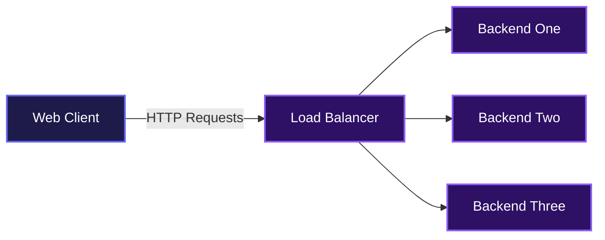
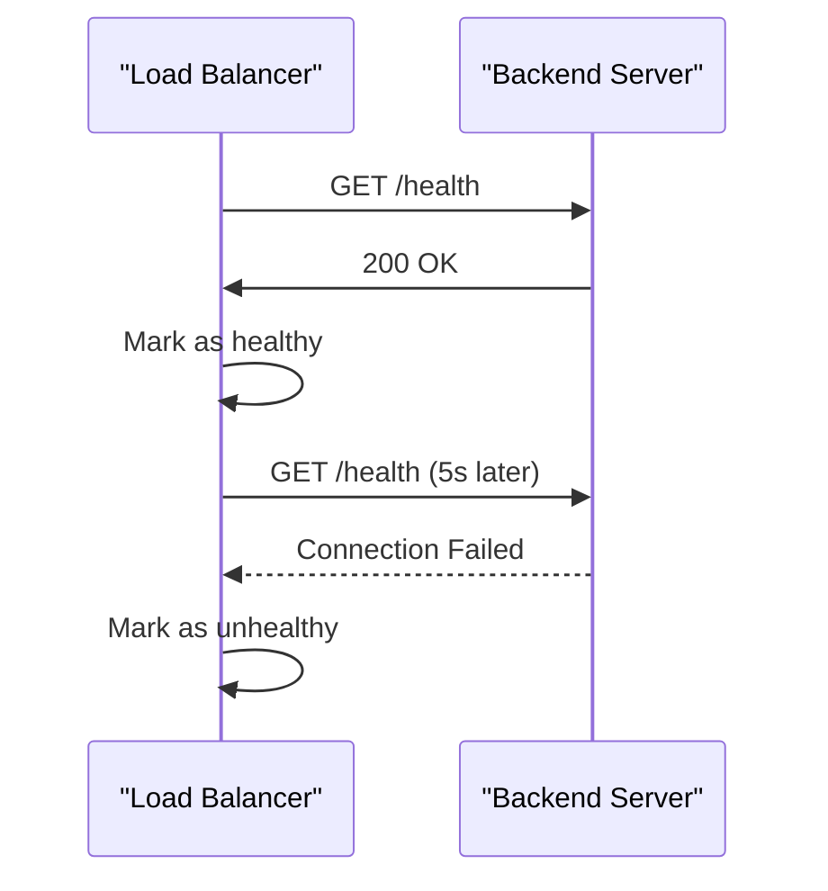
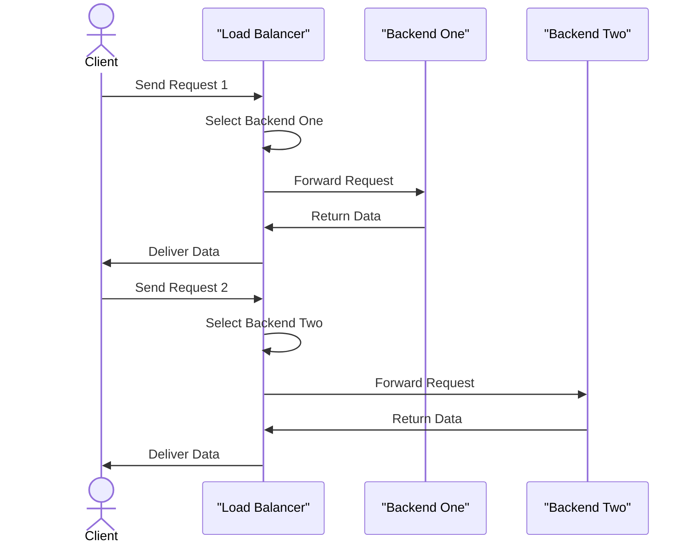

# Simple Load Balancer

Simple Load Balancer helps teams distribute incoming network traffic across multiple backend servers. It monitors server health and automatically routes requests to available servers, ensuring applications stay online even if one node fails. No complicated setup, just straightforward load balancing that works out of the box.

## System Architecture



## Features

### Active Health Checking
The load balancer continuously monitors the health of all registered backend servers. Every 5 seconds, it pings the health endpoint of each server. If a server stops responding or returns an error, the load balancer temporarily removes it from the routing pool until it recovers.



### Round Robin Routing
Incoming traffic is distributed evenly across all available, healthy backend servers using a round-robin algorithm. This prevents any single server from becoming overwhelmed with requests.



## Installation

Follow these steps to run the project locally on your machine.

Clone the Repository:
```bash
git clone https://github.com/SaranHiruthikM/simple-load-balancer.git
```

Navigate into the directory:
```bash
cd simple-load-balancer
```

Build the backend and load balancer binaries:
```bash
go build -o backend-server backend/main.go
go build -o load-balancer lb/main.go
```

## Usage

To see the load balancer in action, you need to start multiple instances of the backend server on different ports, and then start the load balancer.

Start three separate backend servers on ports 9091, 9092, and 9093:
```bash
./backend-server -p1 9091 &
./backend-server -p1 9092 &
./backend-server -p1 9093 &
```

Ensure your `backends.json` file inside the `lb` directory points to these local instances. The content should look like this:
```json
{
  "backends": [
    "http://localhost:9091",
    "http://localhost:9092",
    "http://localhost:9093"
  ]
}
```

Start the load balancer server:
```bash
./load-balancer -config ./lb/backends.json
```

Once running, send traffic to the load balancer on port 8080:
```bash
curl http://localhost:8080/
```

If you run the command multiple times, you will see the response cycle through the different backend ports.

## API Documentation

### GET /
**Description**: The default root endpoint of the backend servers. The load balancer forwards any path to the underlying backends, but this is the primary test route.

**Request**:
```json
{}
```

**Response**:
```text
HelloWorld from Port: 9091
```

**Errors**:
- 502: Returned by the Load Balancer if the selected backend fails to respond.
- 503: Returned by the Load Balancer if no healthy backend instances are available.

### GET /health
**Description**: A diagnostic endpoint used by the load balancer to determine if a backend node is online and capable of accepting traffic.

**Request**:
```json
{}
```

**Response**:
```text
Backend is Healthy at Port: 9091
```

## Technologies Used

| Technology | Description |
| :--- | :--- |
| [Go](https://go.dev/) | Core programming language used for high concurrency |

## Contributing

Contributions are welcome. Feel free to open issues or submit pull requests for enhancements, bug fixes, or documentation updates. Please ensure your code follows the existing style and includes relevant tests for new features.

## Author Info

- LinkedIn: https://linkedin.com/in/saran-hiruthik-m

##

[](https://go.dev/)

[](https://dokugen.samueltuoyo.com)